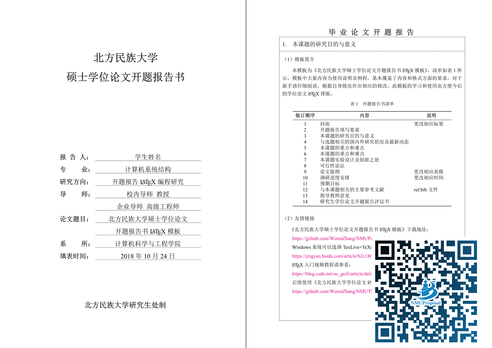
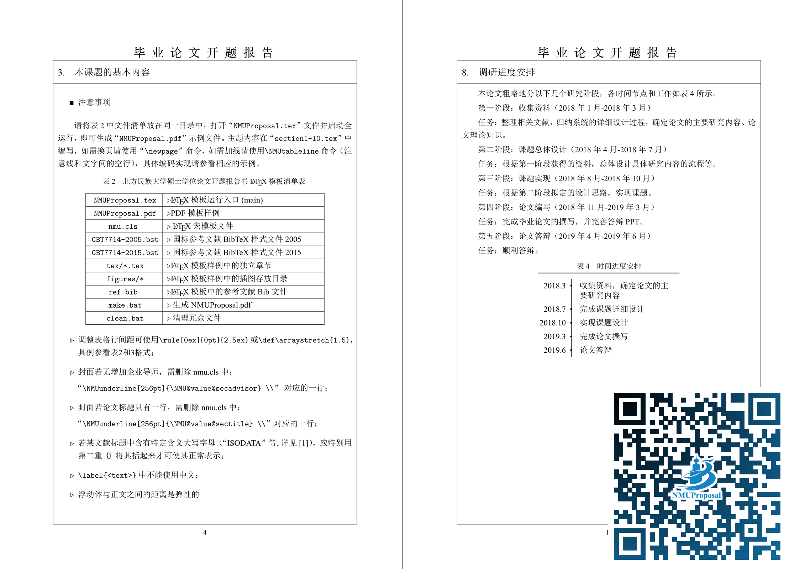
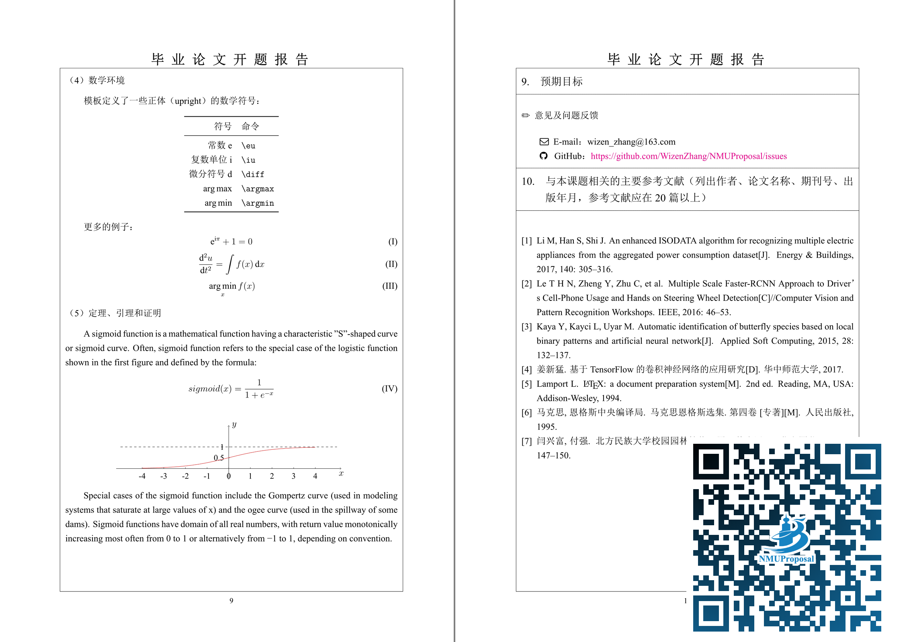

# 北方民族大学硕士学位论文开题报告书LaTeX模板
[](https://github.com/WizenZhang/NMUProposal/releases)   

**本项目为北方民族大学硕士学位论文开题报告书NMUProposal。模板按照Word格式要求改写而来，模板中大量内容为使用说明及例程，基本覆盖了内容和格式方面的要求，对于新手请仔细阅读，根据自身情况作出相应的修改，此模板的学习和使用也方便今后的学位论文LaTeX排版。本模板为个人兴趣之作，仅供学习交流使用。**


## 预览

**PDF下载预览:**[NMUProposal.pdf](https://raw.githubusercontent.com/WizenZhang/NMUProposal/master/NMUProposal.pdf)



   
    

## 下载地址

+ [GitHub](https://github.com/WizenZhang/NMUProposal): [https://github.com/WizenZhang/NMUProposal/releases](https://github.com/WizenZhang/NMUProposal/releases)

## 模板使用

**LaTeX: 参看LaTeX模板示例NMUProposal.tex及相应插入章节tex/*.tex**

## 项目相关

### 项目环境

      

### 项目结构

```
NMUProposal
 |- NMUProposal.tex         // LaTeX模板运行入口(main)
 |- NMUProposal.pdf         // PDF模板样例
 |- nmu.cls               // LaTeX宏模板文件
 |- GBT7714-2005.bst      // 国标参考文献BibTeX样式文件2005版
 |- GBT7714-2015.bst      // 国标参考文献BibTeX样式文件2015版
 |- tex/*.tex             // LaTeX模板样例中的独立章节
 |- figures/*             // LaTeX模板样例中的插图存放目录
 |- ref.bib               // LaTeX模板中的参考文献Bib文件
 |- make.bat              // 生成NMUProposal.pdf
 |- clean.bat             // 清理冗余文件
 +- ReadMe.md             // 本文件
```
## 友情链接

+ Windows系统可以选择TexLive+TeXstudio的方式安装，配置教程请参看百度经验：
[https://jingyan.baidu.com/article/b2c186c83c9b40c46ff6ff4f.html](https://jingyan.baidu.com/article/b2c186c83c9b40c46ff6ff4f.html)

+ LaTeX入门视频教程请参看CSDN：
[https://blog.csdn.net/so_geili/article/details/51702564](https://blog.csdn.net/so_geili/article/details/51702564)

+ 后续使用《北方民族大学学位论文LaTeX模板》下载地址：
[https://github.com/WizenZhang/NMUThesis](https://github.com/WizenZhang/NMUThesis)

## 建议及问题反馈

+ E-mail: [wizen_zhang@163.com](wizen_zhang@163.com)
+ GitHub: [https://github.com/WizenZhang/NMUProposal/issues](https://github.com/WizenZhang/NMUProposal/issues)

## 致谢

感谢[TomHeaven](https://github.com/TomHeaven/nudtproposal)开源的《NUDT硕士博士研究生开题报告latex模板》以及[动力社区](http://bbs.ctex.org/forum.php?mod=viewthread&tid=78547&extra=&page=1)给出的“可跨页带边框文本”解决方案，为本项目LaTeX模板的形成提供了很大的帮助。

***

By [Wizen Zhang](https://wizenzhang.github.io/), at NMU.